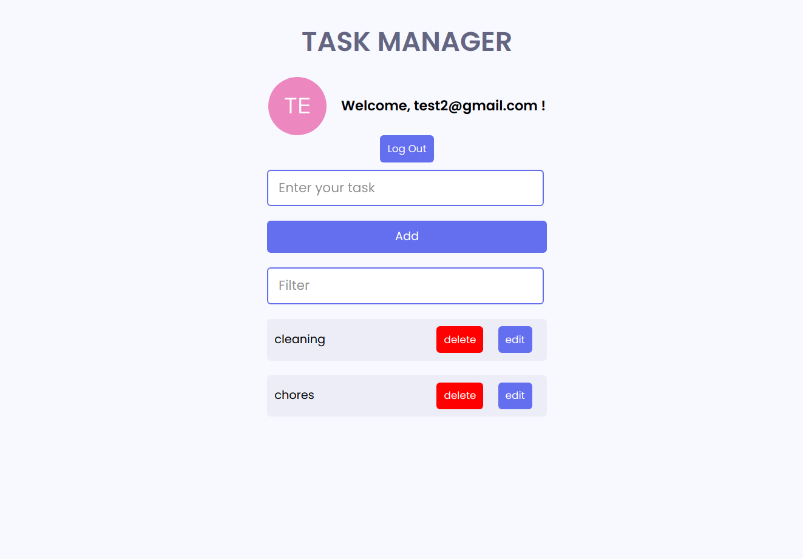

# Task Manager

A task manager app built with TypeScript and React, featuring Auth0 authentication and CRUD operations.

#



## Prerequisites

Before running this app, you must have the following:

* Node.js 17.0 or later installed on your computer
* An auth0 account

## Getting Started

To get started with this app, follow these steps:

1. Clone this repo using the following command:

```bash
git clone https://github.com/builtbysuraj/task-manager.git
```

2. Move to the project directory using the following command:

```bash
cd task-manager
```

3. Install the required dependencies using the following command:

```bash
npm install
```

4. Create a .env file in the root directory of the project and add your auth0 credentials, like this:

```
VITE_DOMAIN=your-auth0-domain-url-goes-here
VITE_CLIENT_ID=your-client-id-goes-here
```

5. Start the development server using the following command:

```bash
npm run dev
```

6. Congratulations ✨, you have successfully started the development server!
